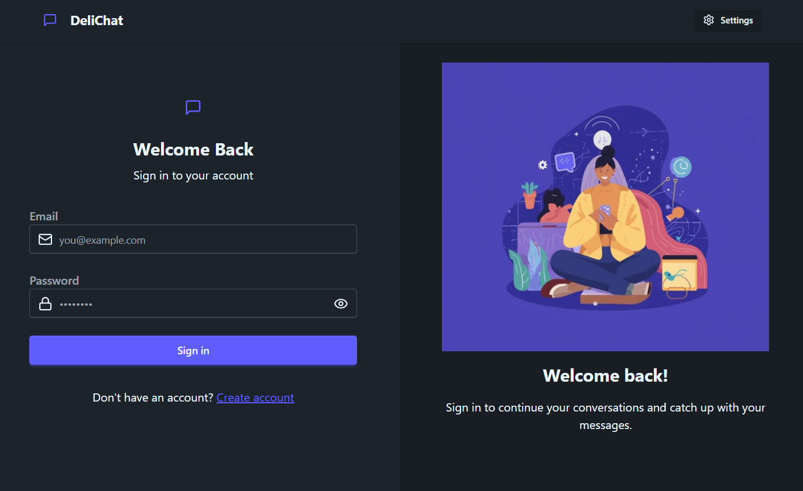
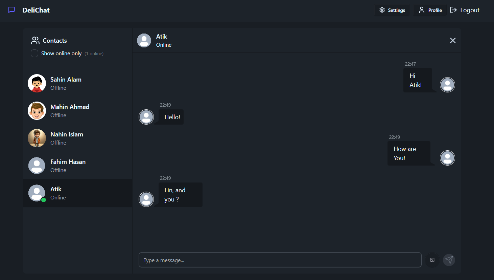

# Delichat - Client

The frontend of the real-time chat app **Delichat**, built using **React**, **Zustand**, and **Socket.IO**. It provides a clean UI for sending and receiving messages instantly and connects to the backend for real-time communication.

---

## Technology
- React.js
- Zustand (State Management)
- Socket.IO
- Tailwind CSS
- Vite
- daisy UI

## Backend & Frontend Links
- **Backend Repo:** [Delichat Server](https://github.com/sahin404/chat-application-server)  
- **Frontend Repo:** [Delichat Client](https://github.com/sahin404/chat-application-client)

## Pages / Screenshots

- **Login Page:**
  

- **Message Page:**
  

---

## Run This Project

```bash
git clone https://github.com/sahin404/chat-application-client.git
cd delichat-client
npm install
npm run dev  # or npm start depending on your setup
